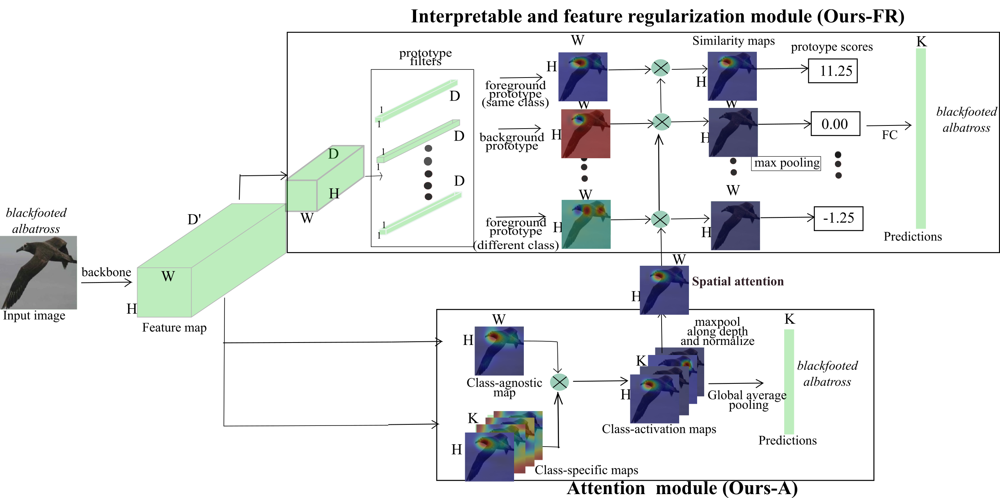

# [Towards Robust Fine-grained Recognition by Maximal Separation of Discriminative Features (ACCV 2020)](https://openaccess.thecvf.com/content/ACCV2020/papers/Nakka_Towards_Robust_Fine-grained_Recognition_by_Maximal_Separation_of_Discriminative_Features_ACCV_2020_paper.pdf)

Krishna Kanth Nakka and Mathieu Salzmann


Implementation of the ACCV 2020 paper: [Towards Robust Fine-grained Recognition by Maximal Separation of Discriminative Features](https://openaccess.thecvf.com/content/ACCV2020/papers/Nakka_Towards_Robust_Fine-grained_Recognition_by_Maximal_Separation_of_Discriminative_Features_ACCV_2020_paper.pdf).

[Main Paper](https://openaccess.thecvf.com/content/ACCV2020/papers/Nakka_Towards_Robust_Fine-grained_Recognition_by_Maximal_Separation_of_Discriminative_Features_ACCV_2020_paper.pdf)<br/>

## Introduction

We introduce an attention-based regularization mechanism that maximally separates the latent features of discriminative regions of different classes
while minimizing the contribution of the non-discriminative regions to the final class prediction.

Our approach consists of two modules acting on the features extracted by a backbone network. The attention module extracts attention maps that help the network to focus on the discriminative image regions. The feature regularization module further uses the attention maps to encourage separating the learned prototypes belonging to different classes


<br>
<p align="center">
  
  <br>
</p>
<br>


## Requirements
We provide a docker image shared in this [google drive location](https://drive.google.com/file/d/1ormSCfk0zXMuYz9MwJxddH9Dukiziyc-/view?usp=sharing). Please build this image to get exact training environment. For the hard-ware infrastructure, we use NVIDIA Tesla V100 32GB as the GPU resource.

In order to load the docker image, please use the command as below; and push it to registry

```bash
docker load  -i ./path_to_docker/accv.tar
```

## Usage

1. Install pytorch

   - The code is tested on Python 3.6, Torch 1.4.0 and NumPy 1.18.1.
   - The code is modified from [ProtoPNet](https://github.com/cfchen-duke/ProtoPNet).

2. Clone the resposity

   ```shell
   git clone https://github.com/krishnakanthnakka/RobustFineGrained/
   ```
3. Dataset
   - Download the  [CUB200](http://www.vision.caltech.edu/visipedia/CUB-200.html) dataset.
   Crop the images using bounding box information.
   - Please put CUB200 test dataset in folder `./datasets/cub200_cropped/test_cropped/` and train dataset in  `./datasets/cub200_cropped/train_cropped/`. For training, we use same augmentation as ProtoPNet and save in the folder  `./datasets/cub200_cropped/train_cropped_augmented/`. Please refer to [ProtoPNet](https://github.com/cfchen-duke/ProtoPNet) for instructions on data augmentation.
   - Please check the [ProtoPNet](https://github.com/cfchen-duke/ProtoPNet)
   for preparing the augmented dataset.

4. Training
   -  Normal training
    - ```shell
      python train.py --net=AttProto --mode=normal --backbone=vgg16 --dataset=cub200
      ```
    - Adversarial training:
    - ```shell
      python train_robust.py --net=AttProto --mode=robust --backbone=vgg16 --dataset=cub200
      ```

5. Pretrained models
    - We released [pretrained robust models](https://drive.switch.ch/index.php/s/DOl73Nrv8I6gJ1v) on vgg16 backobone. Please download and put in this root folder.
6. Evaluation of Robust models
    - For testing on robust models with our approach(Ours-A or Ours-FR), please run:
    - ```shell
      # For attacking attention branch that use same architecture as that of AP
      python run_adv_attack_AttProto.py -branch=A -dataset=cub200 -config=settings_robust.yaml \
      -mode=robust -split=test -backbone=vgg16 -net=AttProto -checkpoint=model.pth -attack=fgsm1_2

      # For attacking feature regularization branch
      python run_adv_attack_AttProto.py -branch=FR -dataset=cub200 -config=settings_robust.yaml \
      -mode=robust -split=test -backbone=vgg16 -net=AttProto -checkpoint=model.pth -attack=fgsm1_2

      ```
   - For testing on robust models with Attention Pooling (AP), please run
   - ```shell
      python run_adv_attack_AP.py -dataset=cub200  -config=settings_robust.yaml \
        -mode=robust -split=test -backbone=vgg16 -net=AP -checkpoint=model.pth -attack=fgsm1_2
      ```
    - For testing on robust models with ProtoPNet, please run
    - ```shell
      python run_adv_attack_Proto.py  -dataset=cub200  -config=settings_robust.yaml \
      -mode=robust -split=test -backbone=vgg16 -net=Proto -checkpoint=model.pth -attack=fgsm1_2
      ```


    - ```shell
      bash run_advexps.sh
      ```
      This will produce results in Table 2 in the main paper for VGG16 backbone, which are:

      |           Model   |   Clean       |   FGSM (1,2)   | FGSM (1,8)   |  BIM (10,2)  | BIM (10,8)    |  PGD (10,2) | PGD (10,8)   |  MIM (10,2)  | MIM (10,8) |
      |----------------:  |:------------: |:------------:  |:------------:|:------------:|:------------:|:------------:|:------------:|:------------:|:------------:
      |        AP*        | 54.9          | 44.9          | 24.2        |  41.9          | 18.2         |  41.2        |  16.9       |  41.9         |   18.7     |
      |        ProtoPNet*  | 60.1          |  44.5         | 26.9         | 57.1         | 10.9         | 35.9         | 10.3         | 37.6          | 13.5      |
      |        Ours-A*    | 69.3          |  56.1          |  34.8        | 51.7         | 29.6         | 50.8         | 28.0         | 52.0          | 32.5      |
      |      Ours-FR*     | 63.0          | 53.3           | 37.2         |  49.4        | 30.5         |  48.1         | 28.4       | 49.7           | 31.1       |


## Citation

if you find our work useful in your research, please consider citing:


```
@InProceedings{Nakka_2020_ACCV,
    author    = {Nakka, Krishna Kanth and Salzmann, Mathieu},
    title     = {Towards Robust Fine-grained Recognition by Maximal Separation of Discriminative Features},
    booktitle = {Proceedings of the Asian Conference on Computer Vision (ACCV)},
    month     = {November},
    year      = {2020}
}
```

## Acknowledgements

We thank [ProtoPNet](https://github.com/cfchen-duke/ProtoPNet) and [Attention Pooling](https://github.com/rohitgirdhar/AttentionalPoolingAction) authors for the code.

